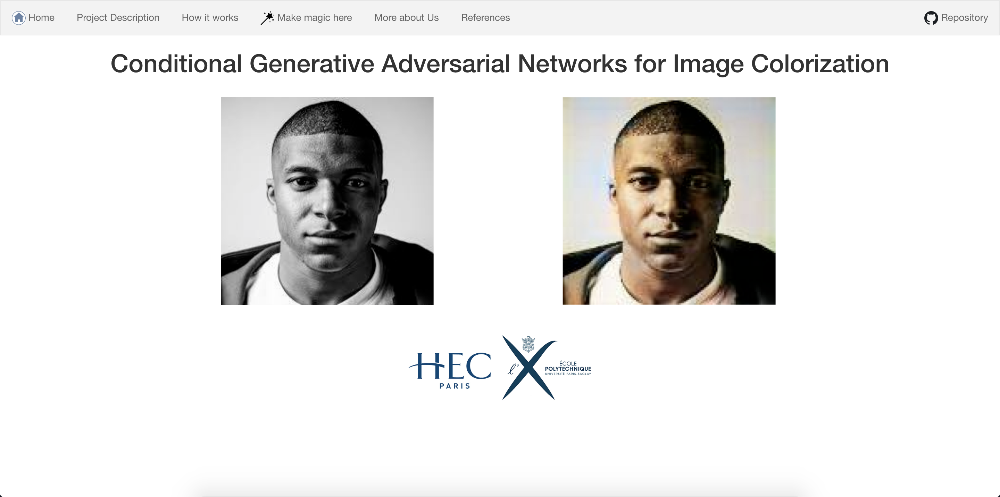

# ColorGANs website 


[VLapparov](https://github.com/vlapparov) and [I](https://github.com/SachaIZADI) made a website in Django from our DeepLearning [class project](https://github.com/SachaIZADI/Colorful-World) about automated colorization of Black and White images.
This repo was forked from [vlapparov's](https://github.com/vlapparov/ColorGANs_site) initial website.

The latest version of the website is available on <href> https://color-gan-x.herokuapp.com <href/> (:warning: it might take a few seconds for the webserver to initially launch when going on the website).


:soon: The website is still under construction. To do list: 
* Add the model architecture in th **How it works** section.
* Build the API in Flask.
* Deploy on Google Cloud.
* Link the API to the website.





## Run the website Locally

If you're interested in running the website locally on you computer, here are the steps you'll need to follow:

```bash
git clone https://github.com/SachaIZADI/ColorGANs_site.git
```

```bash
pip install -r requirements.txt
```

```bash
python manage.py migrate
```

```bash
python manage.py runserver
```

And then go on <href> http://127.0.0.1:8000/ <href/>.

